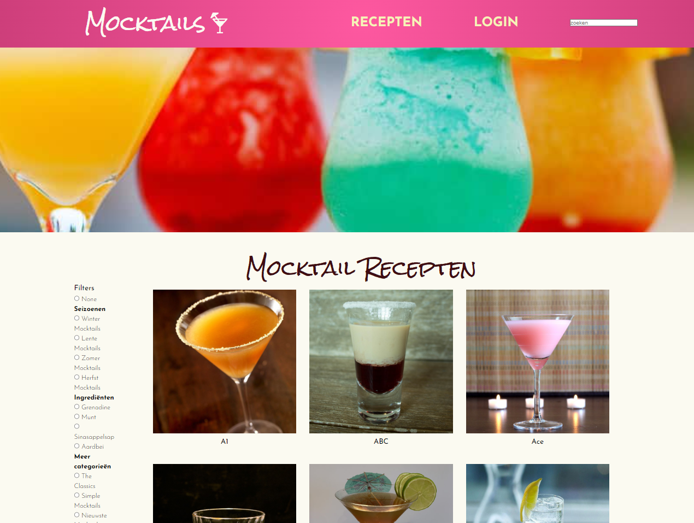

# Mocktail Finder
De Mocktail Finder is een webapplicatie waarmee je gemakkelijk en snel mocktailrecepten kunt vinden.

## Inhoudsopgave
- Installatie
- Gebruik
- Bijdragen

## Installatie
1. Clone de repository:

### `git clone https://github.com/NoekSchrein/eind-opdracht`

2. Installeer de dependencies:

### `npm install`

3. Start de applicatie:

### `npm start`

4. Open de applicatie in je browser op http://localhost:3000.

## Gebruik
Met de Mocktail Finder kun je eenvoudig mocktailrecepten vinden en bekijken. Je kunt zoeken op naam, ingrediënten of categorieën. Als ingelogde gebruiker kun je ook nieuwe recepten toevoegen aan de applicatie, zodat andere gebruikers deze kunnen bekijken.

## API-key 
Voor de ontwikkeling van de Mocktail Finder is gebruik gemaakt van de API [ TheCocktailDB](https://www.thecocktaildb.com/). Hierbij is gebruikt gemaakt van een API-key. Deze is geplaatst in een .env bestand, die niet mee geupload wordt naar Github.

## Bijdragen
Bijdragen aan dit project is altijd welkom. Om bij te dragen kun je het volgende doen:

- Bekijk de lijst met openstaande issues en pak er één op.
- Voeg nieuwe functionaliteit toe aan de applicatie.
- Verbeter de documentatie.
- Rapporteer bugs.
- Maak de code beter.

Je kunt bijdragen door een pull request te openen of door een issue aan te maken.